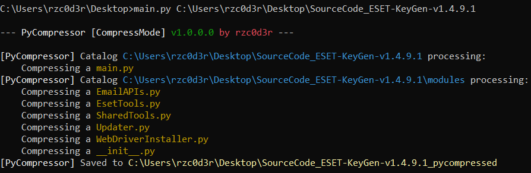
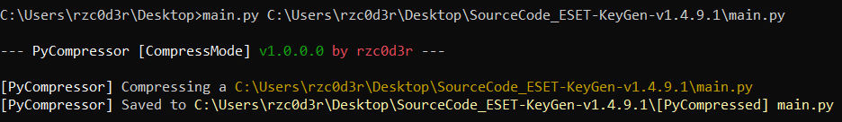
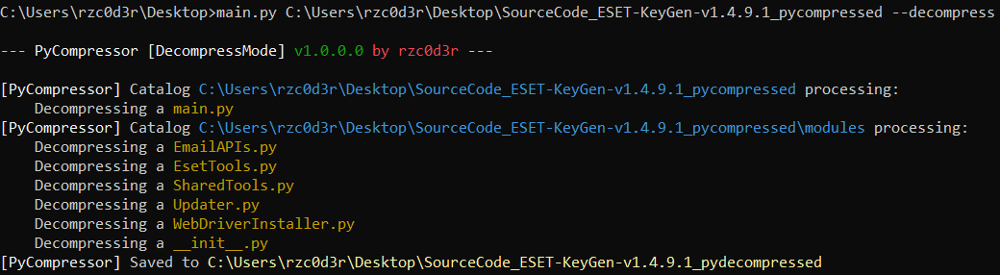
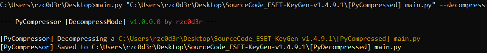
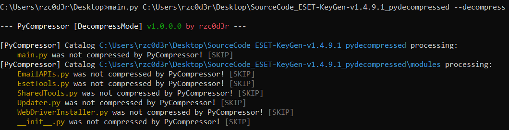

# PyCompressor
PyCompressor - Compresses python files, making the code shorter and more undetectable to antiviruses

---

- **Compressed code will work as well as the source code!!!**

- The program supports 2 modes of operation: code compression and decompression

- It also supports input of both a **single file** for processing and a **whole directory**

- Tested on almost all versions of **python3**

---

## How to use
1. Download the project source code and navigate to its folder

2. Now you need to run the **main.py** file through the console by passing the startup arguments:
   - The first argument is **always** the path to the file or directory to be processed
   - Second argument ```--decompress```, which will decompress the code (**not required**, if you don't specify it, the program will compress)

4. The results will be saved next to the directory or file you specified.

---

## Screenshots
### Successful compression/decompression
#### Code compression in the catalog:


#### Code compression in a file:


---

#### Code decompression in the catalog:


#### Code decompression in a file:


---

### Causes File skipping
#### Attempt to decompress decompressed code

